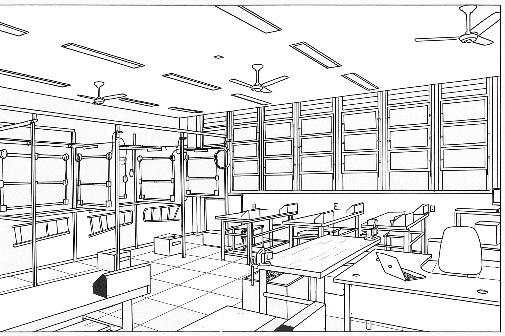

  

# **CENTRO FEDERAL DE EDUCAÇÃO TECNOLÓGICA DE MINAS GERAIS – CEFET-MG**
## **Departamento de Engenharia Elétrica**
### **Coordenação do Curso de Eletrotécnica**

## Disciplina: **PLIEP – Prática de Laboratório de Instalações Elétricas Prediais**

---

## Descrição do Laboratório

O **Laboratório de Instalações Elétricas Prediais** é um ambiente didático especializado para o desenvolvimento de competências técnicas nas áreas de:

- Instalações elétricas residenciais e prediais  
- Automação básica  
- Proteção elétrica  
- Comunicação e redes de dados  

O laboratório dispõe de **06 bancadas**, **painéis e boxes didáticos**, **dispositivos de proteção**, **sistemas de iluminação, sinalização, automação, CFTV, telefonia IP** e **infraestrutura completa para cabeamento estruturado**.

O espaço possibilita a execução de **montagens reais, simulações de campo e testes operacionais**, em conformidade com as normas técnicas vigentes:

- **NBR 5410**
- **NBR 5419**
- **NBR 14565**

📍 **Local:** Sala **203 – Prédio 19**

  

---

## Professores da Disciplina

| Nome | Currículo |
|------|-----------|
| **Prof. Epaminondas Lage** | [🔗 Lattes](http://lattes.cnpq.br/7787341723868111) |
| **Prof. Welligton Passos de Almeida** | [🔗 Lattes](http://lattes.cnpq.br/8651107332611509) |
| **Prof. Henrique dos Reis Paula** | [🔗 Lattes](http://lattes.cnpq.br/7030605162734260) |

---

##  Documentos Importantes
- 🔹 [Ementa da Disciplina](https://github.com/Epaminondaslage/PLIEP/blob/main/ementa_2025.md)
- 🔹 [Normas para Uso do Laboratório](https://github.com/Epaminondaslage/PLIEP/blob/main/normas_de_seguranca.md)

---

<h1>Programação das Aulas Práticas – PLIEP</h1>

<table>
<thead>
<tr>
<th>Aula</th>
<th>Tema</th>
<th>Materiais</th>
</tr>
</thead>
<tbody>

<tr>
<td><b>1ª</b></td>
<td>Normas de Uso do Laboratório</td>
<td>
 <a href="https://drive.google.com/file/d/1eUzfOXdDBA1caKZ-2k_tjds1bMTLJznB">Guia</a> · 
 <a href="https://drive.google.com/file/d/1l9M39J_MzeyCQftY9oC-L6YzVN5ahUXk">Slides</a>
</td>
</tr>

<tr>
<td><b>2ª</b></td>
<td>Identificação de Ferramentas</td>
<td>
 <a href="https://drive.google.com/file/d/1LWhEOQNPkyWHI2VlhK9C-67VIi3IeibS">Guia</a> · 
 <a href="https://drive.google.com/file/d/1sntn04649jLY6V8HYqhLR-EQ1z5vay28">Slides</a>
</td>
</tr>

<tr>
<td><b>3ª</b></td>
<td>Tipos de Emendas</td>
<td>
 <a href="https://drive.google.com/file/d/1oay7kjkCN0j_7KuiU-ajx7eCMxr6iGHb">Guia</a> · 
 <a href="https://drive.google.com/file/d/1g6pzrcdyLA1SxSP70rHitKaamqwJSQbf">Slides</a>
</td>
</tr>

<tr>
<td><b>4ª</b></td>
<td>Simbologia Elétrica</td>
<td>
 <a href="https://drive.google.com/file/d/1EQBDzbkk97IedTg2iE9UqMOZqeqdpAAA">Guia</a> · 
 <a href="https://drive.google.com/file/d/1djlPdTcQTdMrD0rS0Ew3WVlu8DMY7kG9">Slides</a>
</td>
</tr>

<tr>
<td><b>5ª</b></td>
<td>Diagrama Multifilar</td>
<td>
 <a href="https://drive.google.com/file/d/1EcBOpqbTAl7KqqFvyfQYoOmjawwzq7vN">Guia</a> · 
 <a href="https://drive.google.com/file/d/1oZdobB-9jIZ9zCiP8Gq1pkPYCoT7OZoS">Slides</a>
</td>
</tr>

<tr>
<td><b>6ª</b></td>
<td>Diagrama Unifilar</td>
<td>
 <a href="https://drive.google.com/file/d/1wpEcAC3m7oTqJp4ByyFisNT5eGkGVZqA">Guia</a> · 
 <a href="https://drive.google.com/file/d/13YG2mckIwVWOZ6zhaeuXw7oagP_eVBrn">Slides</a>
</td>
</tr>

<tr>
<td><b>7ª</b></td>
<td>Interruptores e Tomadas</td>
<td>
 <a href="https://github.com/Epaminondaslage/painel-didatico-interruptores">GitHub</a>
</td>
</tr>

<tr>
<td><b>8ª</b></td>
<td>Instalações Embutidas I</td>
<td>
 <a href="https://github.com/Epaminondaslage/instalacao-embutida-1">GitHub</a>
</td>
</tr>

<tr>
<td><b>9ª</b></td>
<td>Instalações Embutidas II</td>
<td>
 <a href="https://github.com/Epaminondaslage/instalacao-embutida-2">GitHub</a>
</td>
</tr>

<tr>
<td><b>10ª</b></td>
<td>Lâmpadas LED Tubulares</td>
<td>
 <a href="https://github.com/Epaminondaslage/led-tubular">GitHub</a>
</td>
</tr>

<tr>
<td><b>11ª</b></td>
<td>Sinalizador de Portão</td>
<td>
 <a href="https://github.com/Epaminondaslage/multivibrador-astavel">GitHub</a>
</td>
</tr>

<tr>
<td><b>12ª</b></td>
<td>DR e DPS</td>
<td>
 <a href="https://github.com/Epaminondaslage/dr-dps">GitHub</a>
</td>
</tr>

<tr>
<td><b>13ª</b></td>
<td>Minuteria</td>
<td>
 <a href="https://github.com/Epaminondaslage/DK-C-01">GitHub</a>
</td>
</tr>

<tr>
<td><b>14ª</b></td>
<td>Quadro de Chamadas</td>
<td>
 <a href="https://github.com/Epaminondaslage/quadro_de_chamadas">GitHub</a> · 
 <a href="https://drive.google.com/file/d/1TBwP9LjOKi482zuKBaX_k74yYD7RgEMy">Slides</a>
</td>
</tr>

<tr>
<td><b>15ª</b></td>
<td>Ventilador de Teto</td>
<td>
 <a href="https://github.com/Epaminondaslage/ventilador-de-teto">GitHub</a>
</td>
</tr>

<tr>
<td><b>16ª</b></td>
<td>Relé de Impulso</td>
<td>
 <a href="https://github.com/Epaminondaslage/rele-impulso">GitHub</a>
</td>
</tr>

<tr>
<td><b>17ª</b></td>
<td>Relé Fotoelétrico</td>
<td>
 <a href="https://github.com/Epaminondaslage/rele-fotoeletrico">GitHub</a>
</td>
</tr>

<tr>
<td><b>18ª</b></td>
<td>Chave-Bóia</td>
<td>
 <a href="https://github.com/Epaminondaslage/chave-boia">GitHub</a>
</td>
</tr>

<tr>
<td><b>19ª</b></td>
<td>Programador de Horário</td>
<td>
 <a href="https://github.com/Epaminondaslage/programador-de-horario">GitHub</a>
</td>
</tr>

<tr>
<td><b>20ª</b></td>
<td>Sistemas de CFTV</td>
<td>
 <a href="https://github.com/Epaminondaslage/PLIEP-CFTV">GitHub</a>
</td>
</tr>

<tr>
<td><b>21ª</b></td>
<td>Vídeo Porteiro</td>
<td>
 <a href="https://github.com/Epaminondaslage/video-porteiro">GitHub</a>
</td>
</tr>

<tr>
<td><b>22ª</b></td>
<td>Cabeamento Estruturado</td>
<td>
 <a href="https://drive.google.com/file/d/1NzsIF62M6m5E8GVjR6NKcUD4ptzd1OIR">Guia</a> · 
 <a href="https://drive.google.com/file/d/1llCpq6oF1gC6lu-nBNZfBqK2O17OCh2Q">Slides</a>
</td>
</tr>

<tr>
<td><b>23ª</b></td>
<td>Telefonia IP – PABX</td>
<td>
 <a href="https://drive.google.com/file/d/1GgOUMhBzNwHICMluXs709TqBQ8-HF6aA">Guia</a> · 
 <a href="https://drive.google.com/file/d/181R5DyzGPlcKbSN_KNqWs86Zv3naM-25">Slides</a> · 
 <a href="https://github.com/Epaminondaslage/PLIEP-PBXIP">GitHub</a>
</td>
</tr>

</tbody>
</table>

---

#  Material Didático Complementar

###  Guia – Prof. Colimar Marques Vieira
📎 [Baixar Apostila](https://drive.google.com/file/d/1GgpoYiPZgxRMmqZywpOUZKCYdzChKYSK)

###  Guia – Prof. Welligton Passos de Almeida
📎 [Baixar Apostila](https://drive.google.com/file/d/1O5VKhayPZAwVescObEjfM_ovxF0Cpcu4)

---

#  Agradecimentos

- **Prof. Colimar Marques Vieira**  
  🛠 Elaboração do Guia de Aulas  
  📄 [Currículo Lattes](http://lattes.cnpq.br/4432862799465667)

- **Prof. Welligton Passos de Almeida**  
  🛠 Elaboração do Guia de Aulas  
  📄 [Currículo Lattes](http://lattes.cnpq.br/8651107332611509)